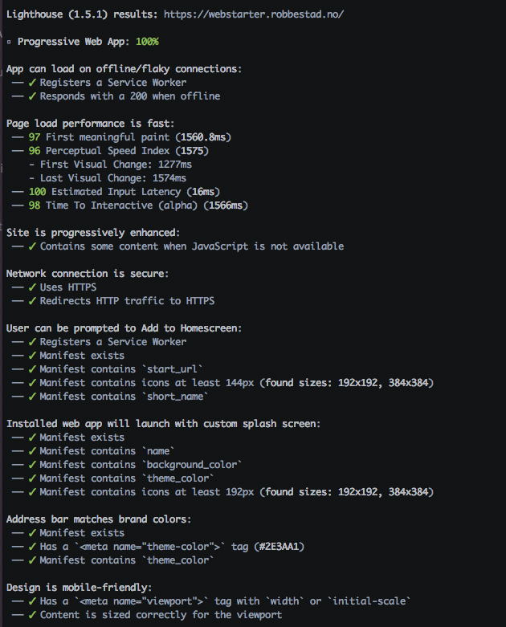

# Web starter

A project that gets you started with the latest and greatest frontend tech.

* Koa for serving files and assets
* Dev and Dist config
* Webpack 2 
* Inferno
* Config vetted for Mac / Windows / Linux

*Built with performance in mind*



## DEMO

[Open demo](https://webstarter.robbestad.no)


## Getting started

1. Clone project with ```git clone https://github.com/svenanders/webstarter.git```

2. Install dependencies (preferably with *yarn*, but plain old *npm* also works fine).    Yarn can be downloaded from [yarnpkg.com](https://yarnpkg.com/lang/en/) or installed via Brew if on Mac
       
        With yarn: $ yarn install
        With npm:  $ npm install

3. Create a basic config file with ```yarn firstrun``` or ```npm run firstrun```  
    
3. Start project with ```yarn dev``` or ```npm run dev```   (defaults to port 5001 and can be displayed on [localhost:5001](http://localhost:5001))

4. Distribution build is generated with ```yarn start``` or ```npm run start``` and defaults to port 1998. It will generate tiny, optimized vendor and app bundles and a minimized index.html.

## API server

The example project comes with a setup to a redis server 
located at [koa-redis-server](https://github.com/svenanders/koa-redis-server). 
This needs to be configured with a *secret.json* file in *src/assets/config*, and must
be identical in both this setup and in the redis server setup.

**You don't need to set up any of this to use the project.**

## Developing

The source lives in the ```src``` folder.

The index.html is generated from the ```src/templates/default.ejs``` template.

Any asset you want to add -- for instance css, local images and so on -- should be placed in the ```src/assets``` folder and 
referenced with ```/assets/``` preceding the file name.

## Custom @NRK packages

### ORIGO DESIGN

Enter *node_modules/@nrk/origo-design* and execute ```grunt minimal``` to run a new CSS build. Update minimal.scss if you want to include more/less stylesheets. Copy the output of the _dist_ folder to _src/assets/style_.

## License

This project is dual licensed with the ISC License and the Beerware license.
Dual licensing means you can pick and choose which one you want to apply. The ISC License gives you free reign to 
do anything with it. The Beerware license encourages you to either buy me a beer "in return" or drink one for yourself. 

